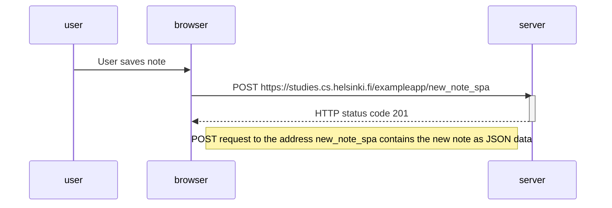

```mermaid
sequenceDiagram
    participant user
    participant browser
    participant server

    user->>browser: User saves note
    browser->>server: POST https://studies.cs.helsinki.fi/exampleapp/new_note_spa
    activate server
    server-->>browser: HTTP status code 201
    deactivate server

    Note right of browser: POST request to the address new_note_spa contains the new note as JSON data
```